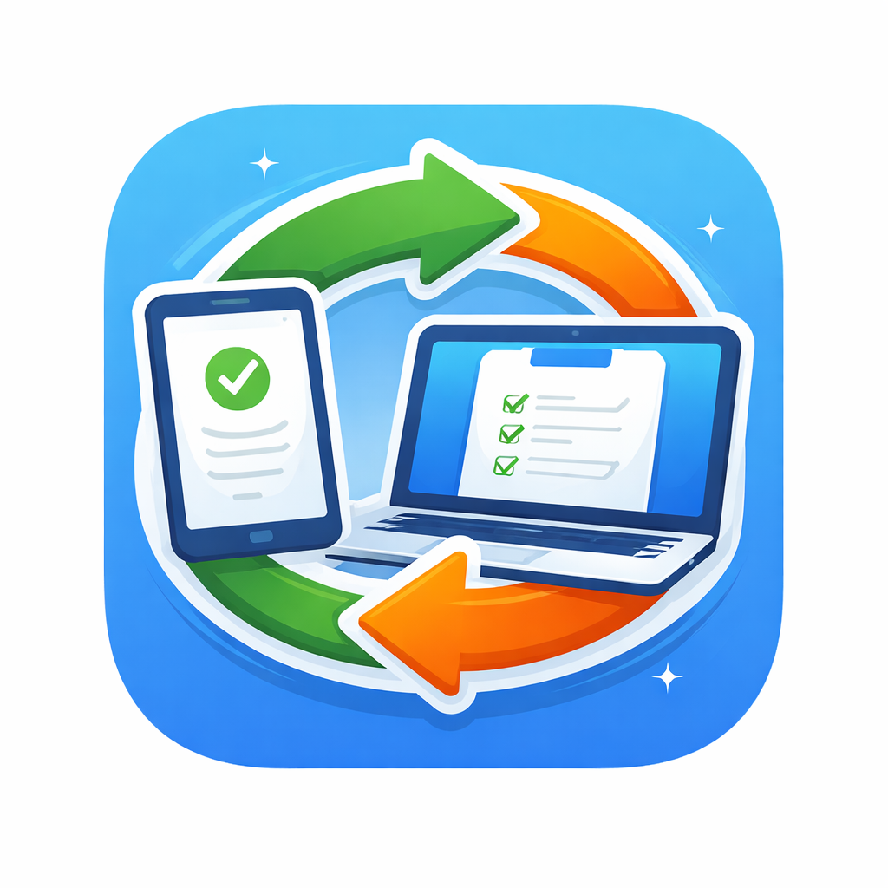

# ClipSync — Premium YouTube Video Downloader



**ClipSync** is a modern, high-performance desktop application for downloading videos and audio from YouTube and other platforms. Built with **Python**, **PySide6**, and **yt-dlp**, it features a stunning glassmorphism UI and robust download capabilities.

---

## 👨‍💻 Developer

**Developed by Dinesh Das**  
*Senior Software Engineer at Asian Paints*

[](https://github.com/Dinesh-Das)
[](https://www.linkedin.com/in/dineshdas1016/)
[](https://x.com/DineshDas_)

---

## ✨ Key Features

- **Premium UI**: Beautiful Dark & Light themes with glassmorphism effects.
- **Smart Downloads**:
  - **Playlists**: Download entire playlists with one click.
  - **Formats**: 4K Video, MP3 Audio, MKV, WEBM.
  - **Metadata**: Embeds thumbnail, title, artist, and chapters automatically.
- **Search Integration**: Search YouTube directly within the app (shows duration & views).
- **Queue System**: Batch processing with Concurrent downloads.
- **Resiliency**: Auto-retries on network failure, resumes interrupted downloads.
- **Portable**: Build a self-contained executable with zero dependencies.

---

## � Usage Guide

### 1. Downloading a Video
1.  **Copy** a YouTube URL (Ctrl+C).
2.  In ClipSync, press **Paste** (or Ctrl+V). The app will auto-fetch metadata.
3.  Select your desired **Format** (Video/Audio) and **Resolution** (e.g., 1080p).
4.  Click **Download**.

### 2. Downloading a Playlist
1.  Paste a Playlist URL.
2.  ClipSync detects it as a playlist.
3.  Click **Add to Queue** (or Download).
4.  Go to the **Queue** tab and click **Start Queue** to download all videos sequentially.

### 3. Using Search
1.  Click the **Search** icon (🔍) next to the Fetch button.
2.  Type your query (e.g., "lofi hip hop").
3.  Double-click a result to load it into the main window.

### 4. Trimming Clips
1.  Check the **Trim Video** box.
2.  Enter **Start Time** (e.g., `00:01:30`) and **End Time** (e.g., `00:02:00`).
3.  Click Download. ClipSync will download only that specific segment.

### ⌨ Shortcuts
| Shortcut | Action |
|----------|--------|
| `Ctrl+V` | Paste URL & Auto-fetch info |
| `Ctrl+Q` | Quit Application |

---

## �🚀 Installation

### Prerequisites
- **Python 3.10+**
- **FFmpeg** (Recommended for merging video+audio)
  - *Note: The build script can automatically bundle FFmpeg if found on your system.*

### Setup
1.  **Clone the repository**:
    ```bash
    git clone https://github.com/Dinesh-Das/ClipSync.git
    cd ClipSync
    ```

2.  **Install dependencies**:
    ```bash
    pip install -r requirements.txt
    ```

3.  **Run the application**:
    ```bash
    python main.py
    ```

---

## 📦 Building the Executable

Create a standalone `.exe` file to share with others.

1.  **Run the build script**:
    ```powershell
    python build.py
    ```
    
    *This script will automatically:*
    -   Install `pyinstaller` and `pillow` if missing.
    -   Detect `ffmpeg.exe` on your system and bundle it.
    -   Package the app with the correct icon and assets.

2.  **Locate the output**:
    -   Navigate to `dist/ClipSync/`.
    -   Run `ClipSync.exe`.
    -   You can zip this folder and share it!

---

## 🛠 Troubleshooting

-   **"FFmpeg not found"**: Ensure `ffmpeg` is installed and added to your system PATH, or place `ffmpeg.exe` in the same folder as `main.py` (or the executable).
-   **Download Errors**: Check your internet connection. Some age-restricted videos require cookies (not yet supported).

---

## 📜 License

This project is for **personal and educational use only**. Please respect YouTube's Terms of Service and copyright laws.
